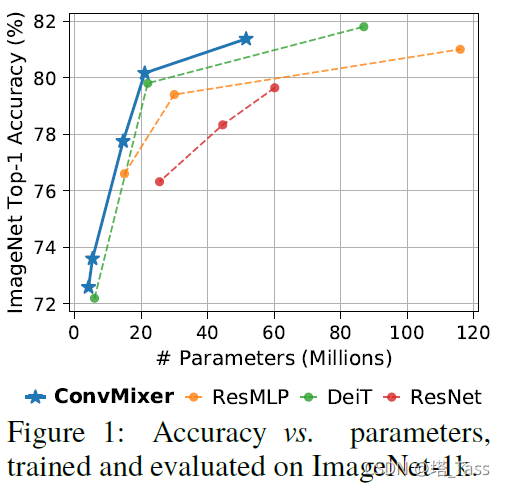
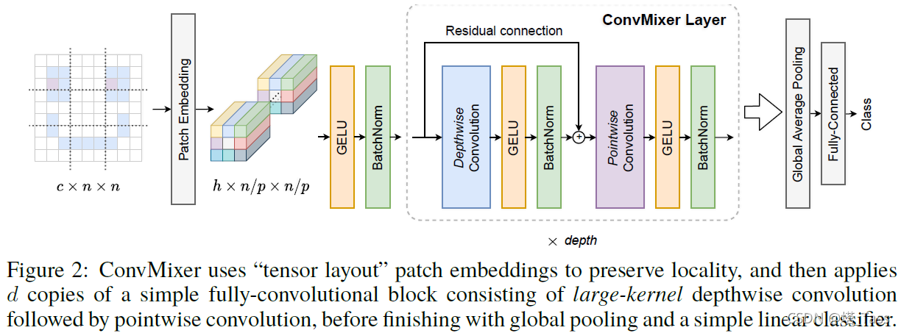

# Patches are all you need?
[论文地址](F://Paper//patches_are_all_you_need_.pdf)

## idea
通过卷积完成ViT操作：该体系结构在许多方面与Vision Transformer（和MLP Mixer）类似：

它直接在patches上操作，在所有层中保持相同的分辨率和大小的表示，在连续层中不进行下采样，并且将“通道（channel-wise）Mixing”与“空间（spatial）Mixing”的信息分离。

但与Vision Transformer和MLP Mixer不同，我们的体系结构仅通过标准卷积完成所有这些操作。

**参数设计**
ConvMixer的实例化取决于四个参数：
- “宽度”或者说隐藏维度（即embedding的维度），
- 深度即ConvMixer层的重复次数，
- 控制模型内部分辨率的patch size，
- 卷积层的kernel size。我们将原始输入大小除以patch size作为内部分辨率；但是请注意，convMixer支持可变大小的输入。